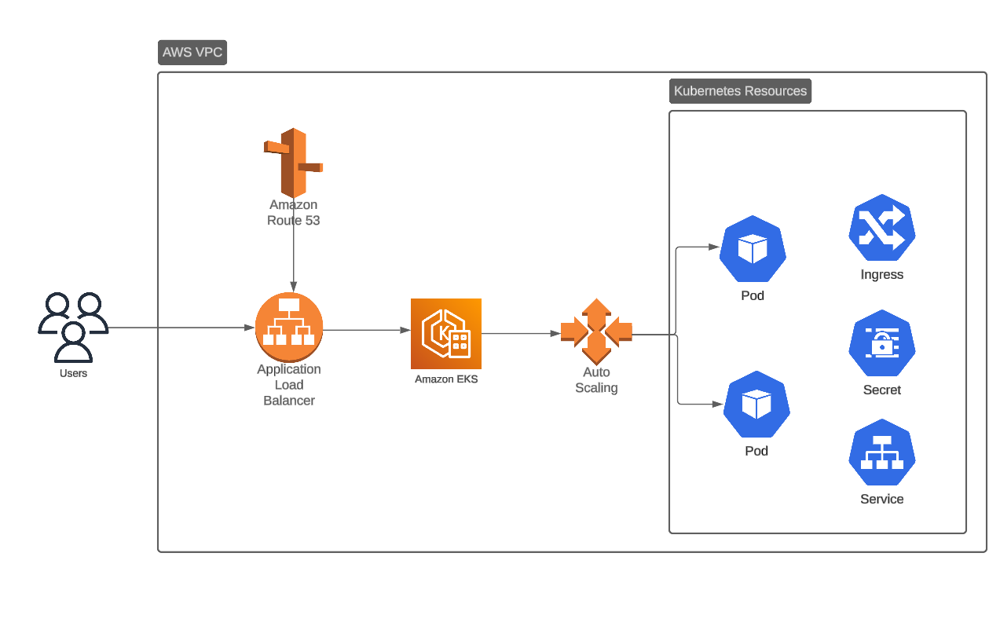
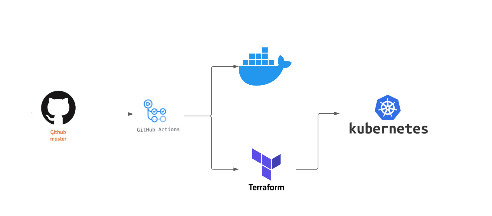

# EKS Challenge

A EKS Challenge for DevOps Engineer.

## Getting Started

### Tech Stack

- Terraform 1.9.6 (IAC)
- AWS  (Cloud vendor)
- Java 17  (API application)
- EKS 1.29 (Cluster)
- Kubectl 1.31.1 (Kube api to interact cluster)

### AWS infrastructure




### Pipeline structure



### Website URL

You can visit the website at [https://devsu-prod.devopsworld.pro](https://devsu-prod.devopsworld.pro/).

### Environment variables for GitHub action

- `AWS_ACCESS_KEY_ID`
- `AWS_SECRET_ACCESS_KEY`
- `GH_TOKEN`
- `GH_USERNAME`
- `BUCKET_NAME`
- `BUCKET_KEY`
- `ENVIRONMENT_TERRAFORM_DEPLOYMENT`
- `CLUSTER_NAME`
- `KUBE_CONFIG_PATH`
- `CONTEXT_NAME`
- `GHCRCRED`

### Terraform Module

```hcl
module "devsu_test" {
  source      = "./modules"

  environment = var.environment

  providers = {
    aws = aws.default_region
  }

  name        = "devsu"
  vpc = {
    cidr_block   = "10.0.0.0/16"
    dns_support  = true
    dns_hostname = true
  }

  subnets = [
    {
      name              = "subnet_1"
      availability_zone = "us-east-1a"
      cidr_block        = "10.0.1.0/24"
    },
    {
      name              = "subnet_2"
      availability_zone = "us-east-1b"
      cidr_block        = "10.0.2.0/24"
    }
  ]

  security_groups = [
    {
      name        = "sg_eks_worker_nodes"
      description = "Security group for the EKS  cluster"
      list_of_rules = [
        {
          name                       = "ingress_rule_1"
          description                = "Allow to connect ssh from port 22 "
          protocol                   = "tcp"
          from_port                  = 22
          to_port                    = 22
          cidr_blocks                = ["0.0.0.0/0"]
          source_security_group_name = null
          type                       = "ingress"
        },
        {
          name                       = "egress_rule_1"
          description                = "Allow outbound traffic to any port"
          protocol                   = "-1"
          from_port                  = 0
          to_port                    = 0
          cidr_blocks                = ["0.0.0.0/0"]
          source_security_group_name = null
          type                       = "egress"
        },
      ]
    },

  ]

  eks = {
    name = "eks_cluster"
    version= "1.29"
    subnets = [
      "subnet_1",
      "subnet_2"
    ]
    node_group = {
      node_group_name = "eks_cluster_group"
      instance_types= [
        "t2.medium"
        ]
      remote_access_key="eks_cluster_vms"
      source_security_group= ["sg_eks_worker_nodes"]
      scaling_config_desired_size = 2
      scaling_config_max_size = 2
      scaling_config_min_size =1
      capacity_type = "ON_DEMAND"
      ami_type = "AL2_x86_64"
      update_config_max_unavailable=1
    }
  }

  iam = {
    cluster_role_name = "eks_role"
    worker_node_role_name = "eks_worker_node_group_role"
    load_balancer_controller_name = "aws-load-balancer-controller"
    lb_policy_name= "ingress_controller_policy"
    external_dns_role_name = "external_dns_role"
    external_dns_policy_name = "external_dns_policy"
  }

  acm_certificate = {
    name                   = "acm_1"
    dns_name               = "devopsworld.pro."
    validation_method      = "DNS"
    route53_record_type    = "A"
    ttl                    = 60
    evaluate_target_health = true
  }


  route53_record = {
    ttl = 60
    records = [
      {
        name                   = "record_1"
        route53_record_type    = "A"
        evaluate_target_health = true
        route53_alias_name     = "devsu"
      },
    ]
  }

  devops_name  = "Enrique"
  project_name = "devsu"

}

```
### Stages of deployment

The pipeline is divided in 4 stages:

#### 1. Application containerization

Setup the environment for java 

```yml
      - name: Set up JDK 17
        uses: actions/setup-java@v4
        with:
          java-version: '17'
          distribution: 'adopt'

      - name: Build with maven 
        run: mvn clean package

```

Containerizes the application 
```yml
      - name: Build and push
        uses: docker/build-push-action@v5
        with:
          push: true
          context: .
          tags: |
            ghcr.io/${{ github.repository }}:${{ steps.slug.outputs.sha7 }}
            ghcr.io/${{ github.repository }}:latest
```


#### 2. Terraform deployment

Set up AWS cli and credentials 

```yml
      - name: Configure AWS Credentials
        uses: aws-actions/configure-aws-credentials@v4
        with:
          aws-access-key-id: ${{ secrets.AWS_ACCESS_KEY_ID }}
          aws-secret-access-key: ${{ secrets.AWS_SECRET_ACCESS_KEY }}
          aws-region: us-east-1

```

Intializes the working directory for terraform and deploy the infrastructure to AWS

```yml
      - name: Terraform init
        working-directory: /home/runner/work/devsu-devops/devsu-devops/terraform
        run: terraform init -backend-config="bucket=${{ secrets.BUCKET_NAME }}" -backend-config="key=${{ secrets.BUCKET_KEY }}"

      - name: Terraform apply
        working-directory: /home/runner/work/devsu-devops/devsu-devops/terraform
        run: terraform apply --var="environment=${{ secrets.ENVIRONMENT_TERRAFORM_DEPLOYMENT }}" --auto-approve
```


#### 3. Kubernetes deployment

Provides the kubeconfig file
```yml
      - name: Get and set kubeconfig
        run: |
          aws eks --region us-east-1 update-kubeconfig --name ${{ secrets.CLUSTER_NAME }} --kubeconfig ${{ secrets.KUBE_CONFIG_PATH }}
          kubectl config set-context ${{secrets.CONTEXT_NAME }}
```

Install dependencies and pull secret and save it as manifest
```yml
      - name: Install external-DNS
        working-directory: /home/runner/work/devsu-devops/devsu-devops/manifests
        run: kubectl  apply -f dns-serviceaccount.yml

      - name: Aggregate secret for accessing GitHub Container Registry from k8s
        working-directory: /home/runner/work/devsu-devops/devsu-devops/manifests
        run: | 
          cat << 'EOF' > ghcrcred.yml
          ${{ secrets.GHCRCRED }}
          EOF
```

Deploy manifests to EKS cluster
```yml
      - name: Deploy devsu test
        working-directory: /home/runner/work/devsu-devops/devsu-devops/manifests
        run: | 
          kubectl apply -f namespace.yml
          kubectl apply -f ghcrcred.yml
          kubectl apply -f deployment.yml
```

#### 4.  Terraform destroy

Remove the namespace and its resources
```yml
      - name: Removing k8s namespace and resources
        run: kubectl delete namespace devsu
```

Initializes the working directory and destroy the infrastructure
```yml
      - name: Terraform init
        working-directory: /home/runner/work/devsu-devops/devsu-devops/terraform
        run: terraform init -backend-config="bucket=${{ secrets.BUCKET_NAME }}" -backend-config="key=${{ secrets.BUCKET_KEY }}"

      - name: Terraform apply
        working-directory: /home/runner/work/devsu-devops/devsu-devops/terraform
        run: terraform destroy --var="environment=${{ secrets.ENVIRONMENT_TERRAFORM_DEPLOYMENT }}" --auto-approve
```

### Notes
For any inquiries, please feel free to contact me at enrique.cs095@gmail.com.
